# LAB 7.1 #
## ข้อ 1 ##
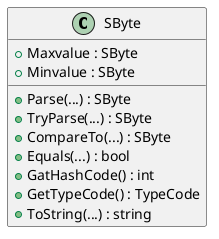

## ข้อ 2 ##
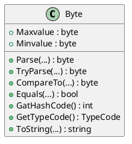

## ข้อ 3 ##
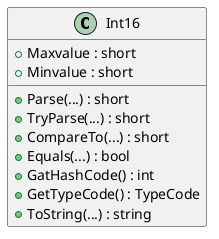

## ข้อ 4 ##
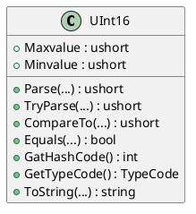

## ข้อ 5 ##
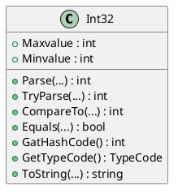

## ข้อ 6 ##
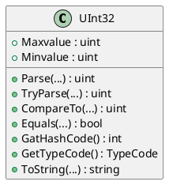

## ข้อ 7 ##
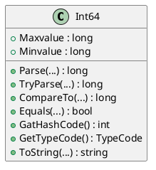

## ข้อ 8 ##
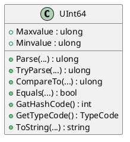

## ข้อ 9 ##
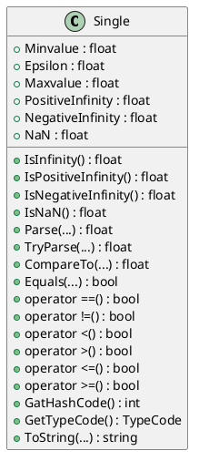

## ข้อ 10 ##
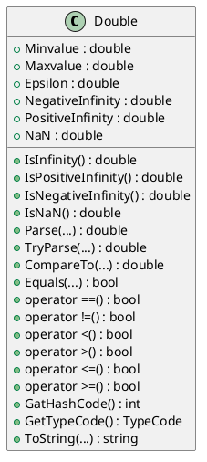

## ข้อ 11 ##
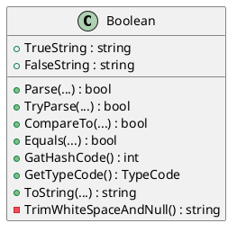

## ข้อ 12 ##
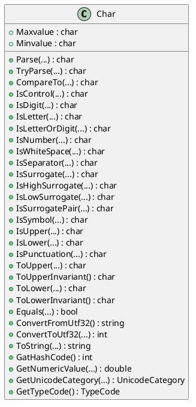

## ข้อ 13 ##
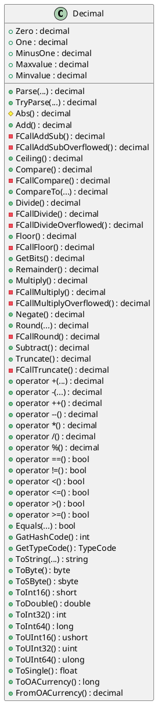

## ข้อ 14 ##
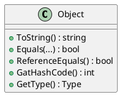

## ข้อ15 ##
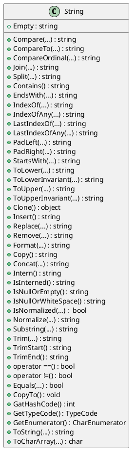

## LAB 7.2 ##
# debug #

