# การทดลองสัปดาห์ที่ 7.1 #
เขียนโค้ด PlantUML สำหรับ type ชนิดอื่น ๆ โดยใช้วิธีเดียวกันกับขั้นตอนที่ 3 ในชนิดข้อมูล SByte เพื่อสร้าง diagram สำหรับ predefined type ทุกชนิด

## ข้อ 1 sbyte ##

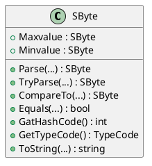

## ข้อ 2 byte ##

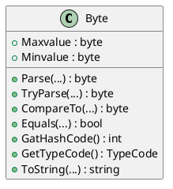

## ข้อ 3 short ##

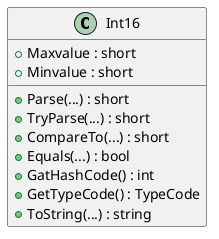

## ข้อ 4 ushort ##

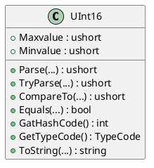

## ข้อ 5 int ##

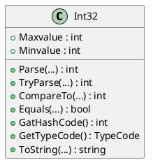

## ข้อ 6 uint ##

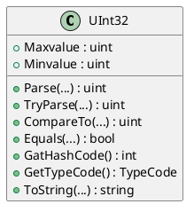

## ข้อ 7 long ##

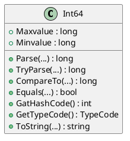

## ข้อ 8 ulong ##

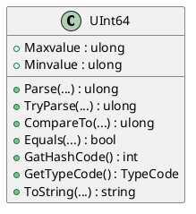

## ข้อ 9 float ##

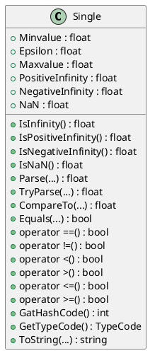

## ข้อ 10 double ##

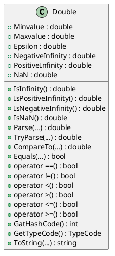

## ข้อ 11 bool ##

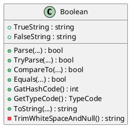

## ข้อ 12 char ##

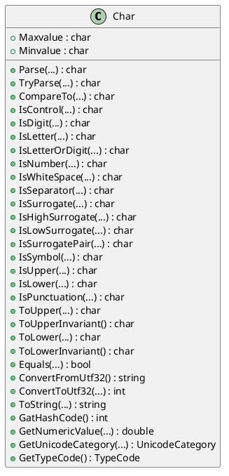

## ข้อ 13 decimal ##

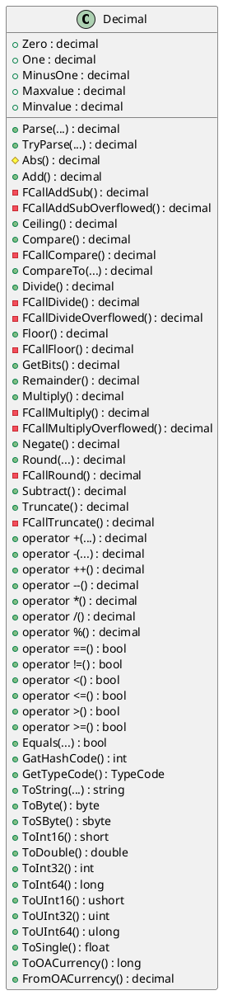

## ข้อ 14 object ##

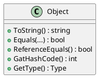

## ข้อ 15 string ##

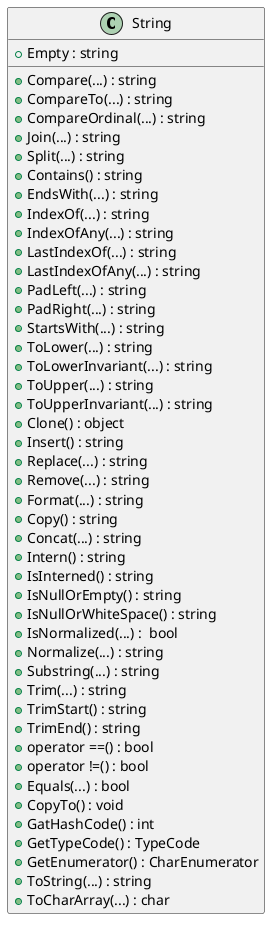

# การทดลองสัปดาห์ที่ 7.2 #
แสดงรายละเอียดของ predefined type

