# การทดลองสัปดาห์ที่ 7.1 #
เขียนโค้ด PlantUML สำหรับ type ชนิดอื่น ๆ โดยใช้วิธีเดียวกันกับขั้นตอนที่ 3 ในชนิดข้อมูล SByte เพื่อสร้าง diagram สำหรับ predefined type ทุกชนิด

## 1.sbyte ##

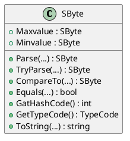

 <b>รูปที่ 1</b> diagram ของ sbyte 

## 2.byte ##

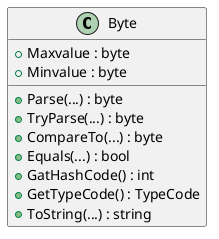

 <b>รูปที่ 2</b> diagram ของ byte 

## 3.short ##

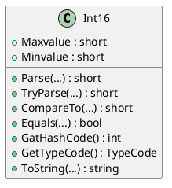

 <b>รูปที่ 3</b> diagram ของ short 

## 4.ushort ##

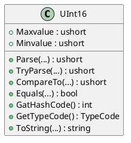

 <b>รูปที่ 4</b> diagram ของ ushort 

## 5.int ##

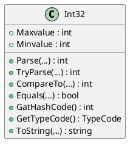

 <b>รูปที่ 5</b> diagram ของ int 

## 6.uint ##

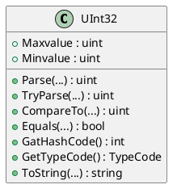

 <b>รูปที่ 6</b> diagram ของ uint 

## 7.long ##

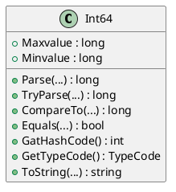

 <b>รูปที่ 7</b> diagram ของ long 

## 8.ulong ##

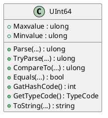

 <b>รูปที่ 8</b> diagram ของ ulong 

## 9.float ##

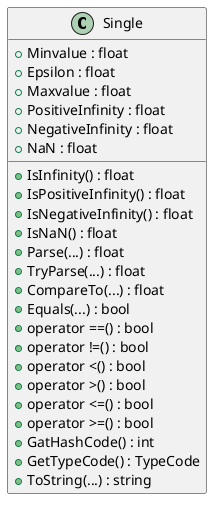

 <b>รูปที่ 9</b> diagram ของ float 

## 10.double ##

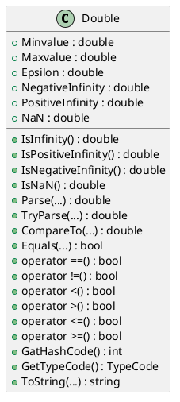

 <b>รูปที่ 10</b> diagram ของ double 

## 11.bool ##

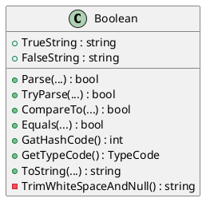

 <b>รูปที่ 11</b> diagram ของ bool 

## 12.char ##

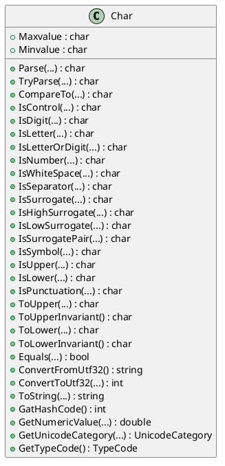

 <b>รูปที่ 12</b> diagram ของ char 

## 13.decimal ##

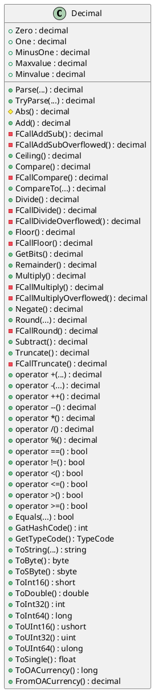

 <b>รูปที่ 13</b> diagram ของ decimal 

## 14.object ##

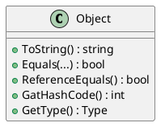

 <b>รูปที่ 14</b> diagram ของ object 

## 15.string ##

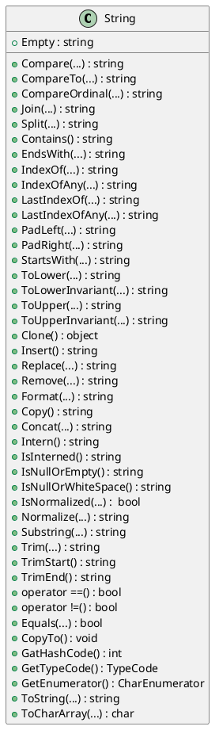

 <b>รูปที่ 15</b> diagram ของ string 

# การทดลองสัปดาห์ที่ 7.2 #
แสดงรายละเอียดของ predefined type

 <b>รูปแสดงผลที่ได้จากการรันโปรแกรม</b> 

