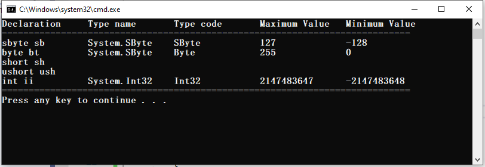

# การทดลองสัปดาห์ที่ 7.2 #
## แสดงรายละเอียดของ predefined type ในภาษา C#  ##


### Learning Outcome ###
1. นักศึกษารู้จัก predefined type และบอกได้ว่ามีอะไรบ้าง
2. นักศึกษาสามารถเขียนโปรแกรมเพื่อรายงานค่าเฉพาะตัวของ predefined type ได้

## งานที่ต้องทำให้สำเร็จ ##

แก้ไขโค้ดตัวอย่าง ให้รายงานรายละเอียดของ predefine type ได้ครบถ้วน
```cs
using System;
using System.Collections.Generic;
using System.Linq;
using System.Text;
using System.Threading.Tasks;

namespace Week07_Lab2
{
    class Program
    {
        static void Main(string[] args)
        {
            sbyte sb = new sbyte();  // create new object
            byte bt = new byte();
            short sh = new short();
            ushort ush = new ushort();
            int ii = new int();
            uint ui = new uint();
            long lo = new long();
            ulong ul = new ulong();
            float fl = new float();
            double db = new double();
            bool bl = new bool();
            char ch = new char();
            decimal de = new decimal();

            object ob = new object();
            string st = new string(new char[] { });
            //dynamic dy = new { };
            dynamic dy = new System.Dynamic.ExpandoObject();

            Console.WriteLine($"Declaration\tType name\tType code\tMaximum Value\tMinimum Value");
            Console.WriteLine($"----------------------------------------------------------------------------");
            Console.WriteLine($"sbyte sb\t{sb.GetType()}\t{sb.GetTypeCode()}\t\t{sbyte.MaxValue}\t\t{sbyte.MinValue}");
            Console.WriteLine($"byte bt\t\t{bt.GetType()}\t{bt.GetTypeCode()}\t\t{byte.MaxValue}\t\t{byte.MinValue}");
            Console.WriteLine($"short sh\t{sh.GetType()}\t{sh.GetTypeCode()}\t\t{short.MaxValue}\t\t{short.MinValue}");
            Console.WriteLine($"ushort ush\t{ush.GetType()}\t{ush.GetTypeCode()}\t\t{ushort.MaxValue}\t\t{ushort.MinValue}");
            Console.WriteLine($"int ii\t\t{ii.GetType()}\t{ii.GetTypeCode()}\t\t{int.MaxValue}\t{int.MinValue} ");
            Console.WriteLine($"uint ui\t\t{ui.GetType()}\t{ui.GetTypeCode()}\t\t{uint.MaxValue}\t{uint.MinValue} ");
            Console.WriteLine($"long lo\t\t{lo.GetType()}\t{lo.GetTypeCode()}\t\t{long.MaxValue}\t{long.MinValue} ");
            Console.WriteLine($"ulong ul\t{ul.GetType()}\t{ul.GetTypeCode()}\t\t{ulong.MaxValue}\t{ulong.MinValue} ");
            Console.WriteLine($"float fl\t{fl.GetType()}\t{fl.GetTypeCode()}\t\t{float.MaxValue}\t{float.MinValue} ");
            Console.WriteLine($"double db\t{db.GetType()}\t{db.GetTypeCode()}\t\t{double.MaxValue}\t{double.MinValue} ");
            Console.WriteLine($"bool bl\t\t{bl.GetType()}\t{bl.GetTypeCode()}\t\t{bool.TrueString}\t{bool.FalseString} ");
            Console.WriteLine($"char ch\t\t{ch.GetType()}\t{ch.GetTypeCode()}\t\t{char.MaxValue}\t{char.MinValue} ");
            Console.WriteLine($"decimal de\t{de.GetType()}\t{de.GetTypeCode()}\t\t{decimal.MaxValue}\t{decimal.MinValue} ");
            Console.WriteLine($"object ob\t{ob.GetType()}\t{"---"}\t\t{decimal.MaxValue}\t{decimal.MinValue} ");
            Console.WriteLine($"string st\t{st.GetType()}\t{st.GetTypeCode()}\t\t{"---"}\t{"---"} ");
            Console.WriteLine($"dynamic dy\t{dy.GetType()}\t{"---"}\t{"---"}\t{"---"} ");


            Console.WriteLine("============================================================================");
            Console.ReadKey();
        }
    }
}

```

<p align = "center">  </p>


<p align = "center"> <b>รูปที่ 1 </b> ผลที่ได้จากการรันโปรแกรม</p>

### Hint ###
1. อาจจะต้องสร้าง object ด้วยคำสั่ง `new ___();`
2. อาจจะต้องเพิ่มหรือลด `\t` ใน `Console.WriteLine(...)` เพื่อให้การแสดงผลมีระยะเหมาะสม
3. การใช้  `$"..........."` ในเมธอด `Console.WriteLine(...)` เรียกว่า `string interpreter` ช่วยให้เราไม่ต้องกังวลเรื่องตำแหน่งของ place holder ในข้อความ สามารถแทรกตัวแปรลงในเครื่องหมาย `{...}` ได้เลย คอมไพเลอร์จะแปลงเป็น string ให้โดยอัตโนมัติ  (และสามารถกำหนดรูปแบบได้้เช่นเดียวกับ string formatting ด้วยวิธีการเดิม)

