# การทดลองสัปดาห์ที่ 7.1 #
เขียนโค้ด PlantUML สำหรับ type ชนิดอื่น ๆ โดยใช้วิธีเดียวกันกับขั้นตอนที่ 3 ในชนิดข้อมูล SByte เพื่อสร้าง diagram สำหรับ predefined type ทุกชนิด

## 1.sbyte ##

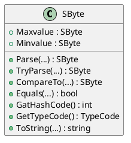

## 2.byte ##

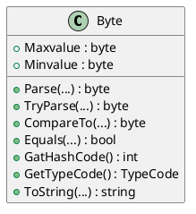

## 3.short ##

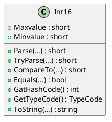

## 4.ushort ##

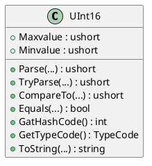

## 5.int ##

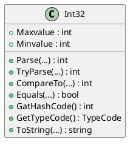

## 6.uint ##

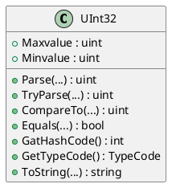

## 7.long ##

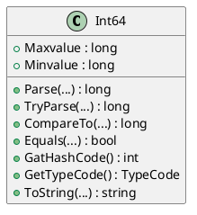

## 8.ulong ##

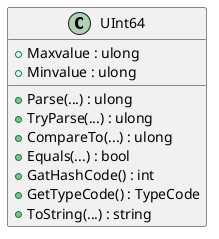

## 9.float ##

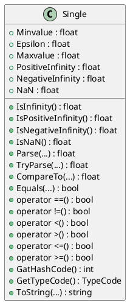

## 10.double ##

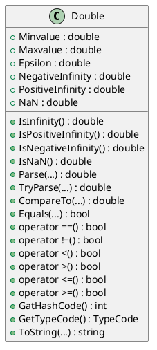

## 11.bool ##

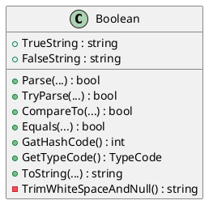

## 12.char ##

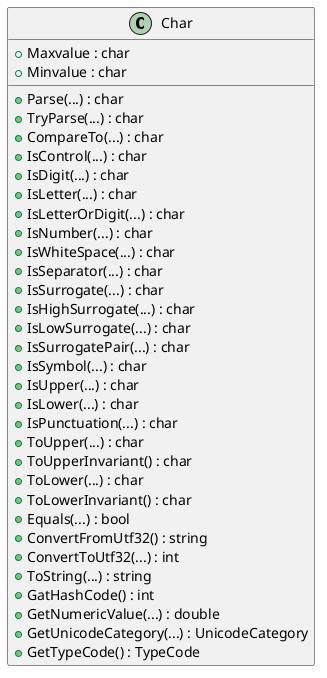

## 13.decimal ##

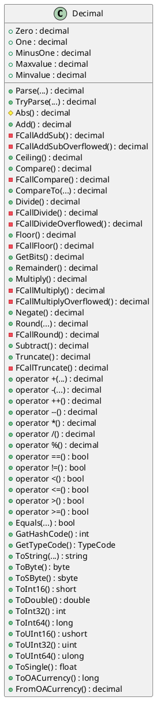

## 14.object ##

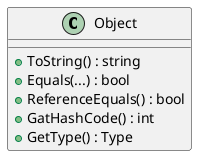

## 15.string ##

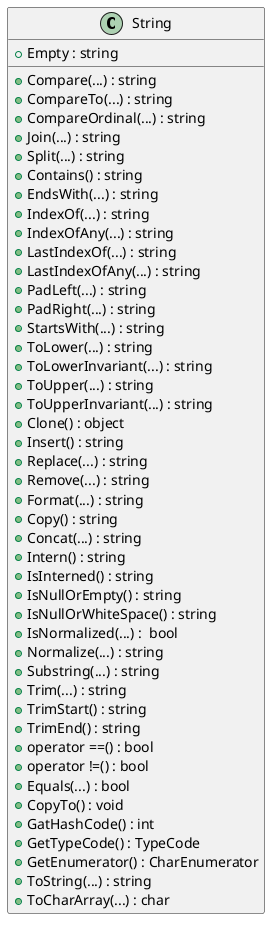
# การทดลองสัปดาห์ที่ 7.2 #
แสดงรายละเอียดของ predefined type

