# Week7.1 #

## ข้อ1 ##

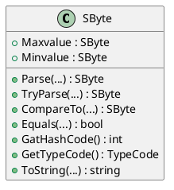

## ข้อ2 ##

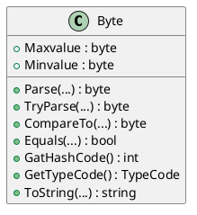

## ข้อ3 ##

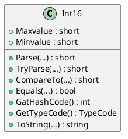

## ข้อ4 ##

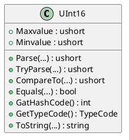

## ข้อ5 ##

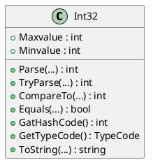

## ข้อ6 ##

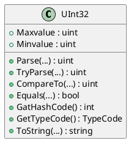

## ข้อ7 ##

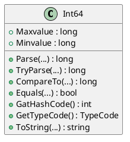

## ข้อ8 ##

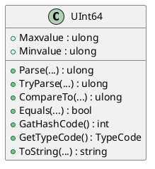

## ข้อ9 ##

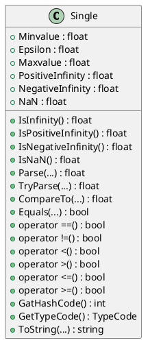

## ข้อ10 ##

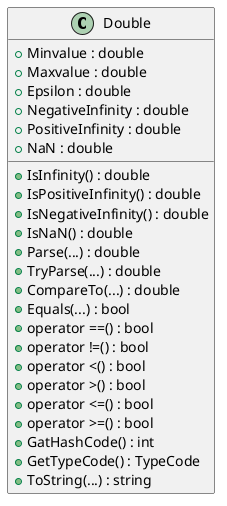

## ข้อ11 ##

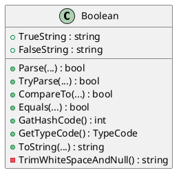

## ข้อ12 ##

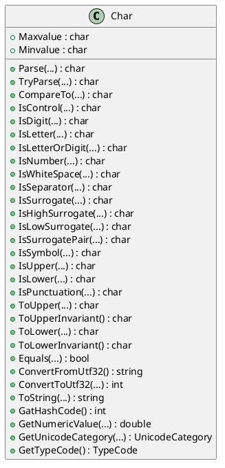

## ข้อ 13 ##

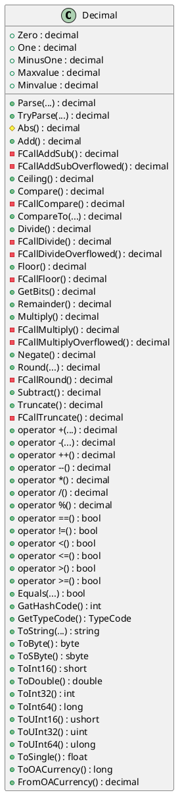

## ข้อ14 ##

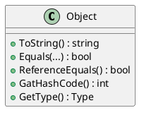

## ข้อ15 ##

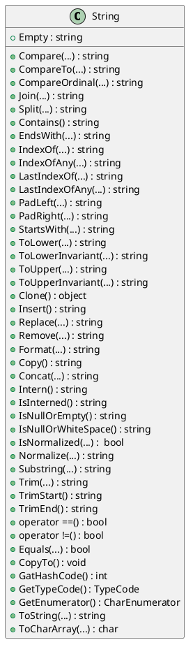

# Week7.2 #

